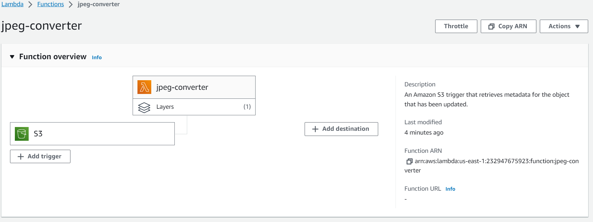
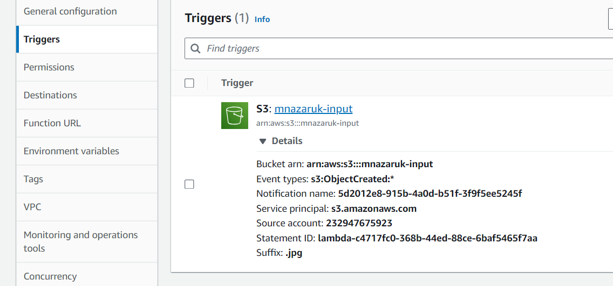
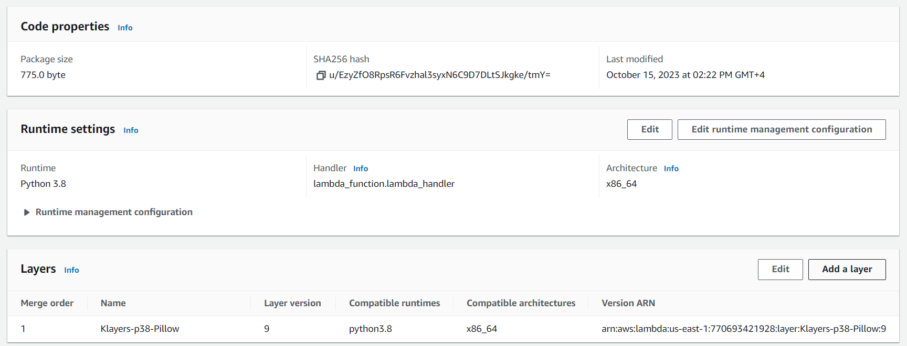
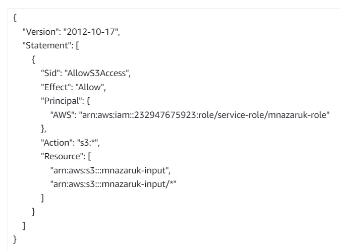

1) Create buckets for uploading .jpg and downloading .png

2) Create Lambda function. I use Amazon Python "Get S3 Object" IMA. Create Role for this lambda.
Add s3 bucket event "object created" as event source

3) Add layer with Python 'Pillow' library, so we can convert picture type

4) Add our lambda role permission to our s3 buckets

5) Add code to our lambda function (in folder ./func)
7) upload a .jpg file to our input bucket. In my case it is "mnazaruk-input". PNG version of this file will appear in output bucket (mnazaruk-output)